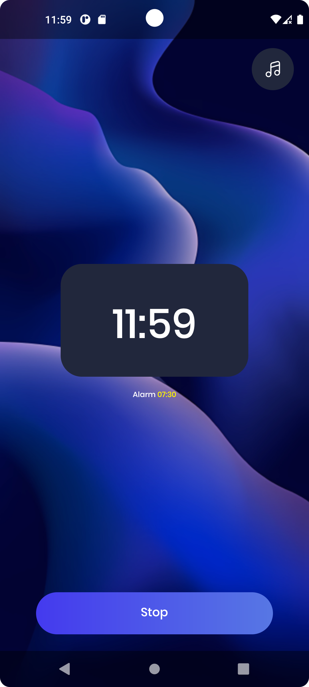
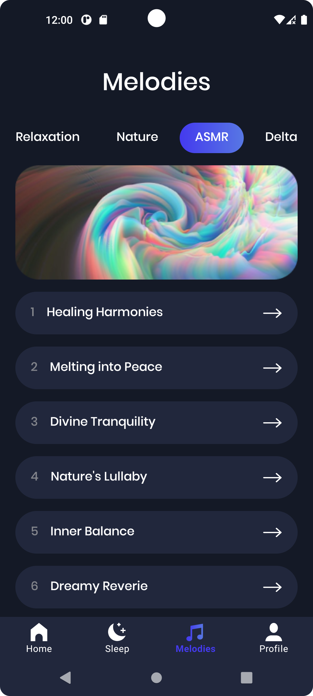
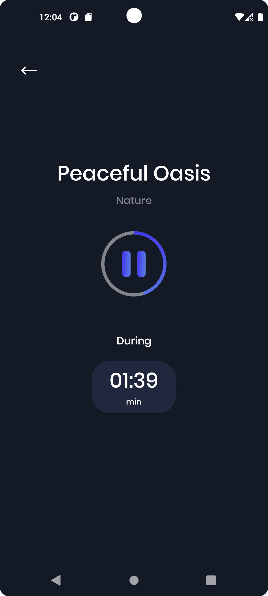
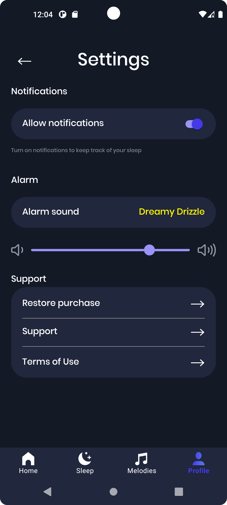
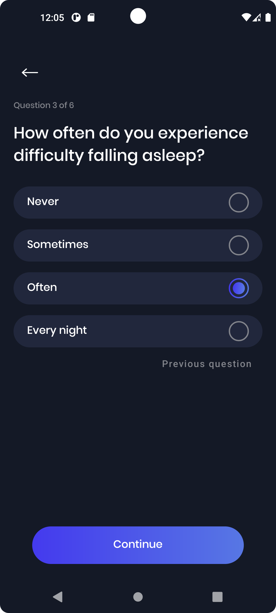
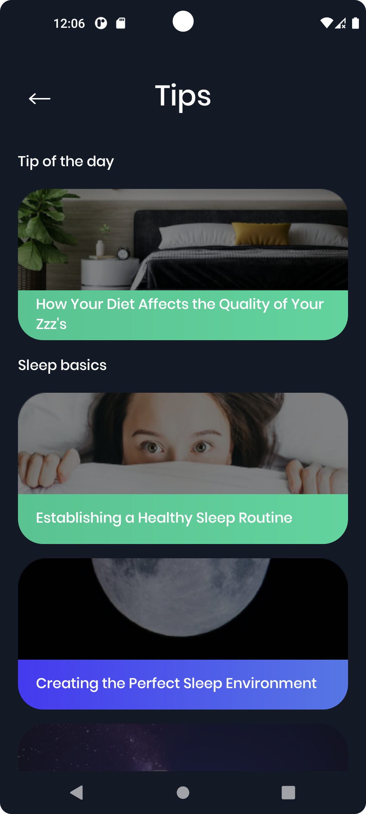

# MeditationApp

Приложение MeditationApp разработано для того, чтобы помочь пользователю улучшить качество сна, тем самым улучшив и качество его жизни. В приложении реализован будильник и плеер с успокаивающими мелодиями для медитации. Также содержится полезные контент о том, как улучшить свой сон. 🌙✨

Приложение имеет следующий функциональность:
  - Установка и управление временем будильника
  - Воспроизведение запланированного сигнала
  - Выбор пользователем мелодии сигнала
  - Воспроизведение аудиотреков в плеере через сеть
  - Установка длительности прослушивания трека 
  - Заполнение пользователем анкеты данных
  - Предоставление премиум-контента пользователю по системе подписки

         

    

    
