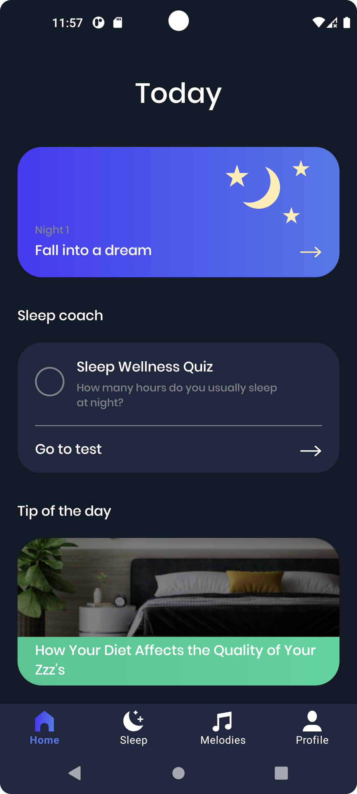

# MeditationApp

Приложение MeditationApp разработано для того, чтобы помочь пользователю улучшить качество сна, тем самым улучшив и качество его жизни. В приложении реализован будильник и плеер с успокаивающими мелодиями для медитации. Также содержится полезные контент о том, как улучшить свой сон.

         

    

    
